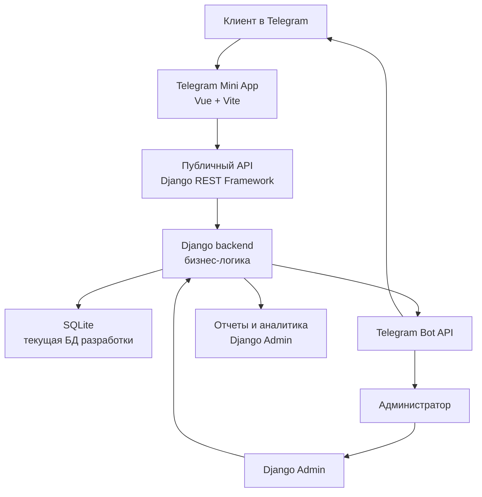
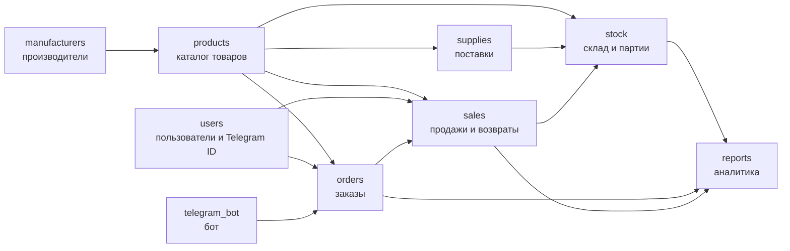
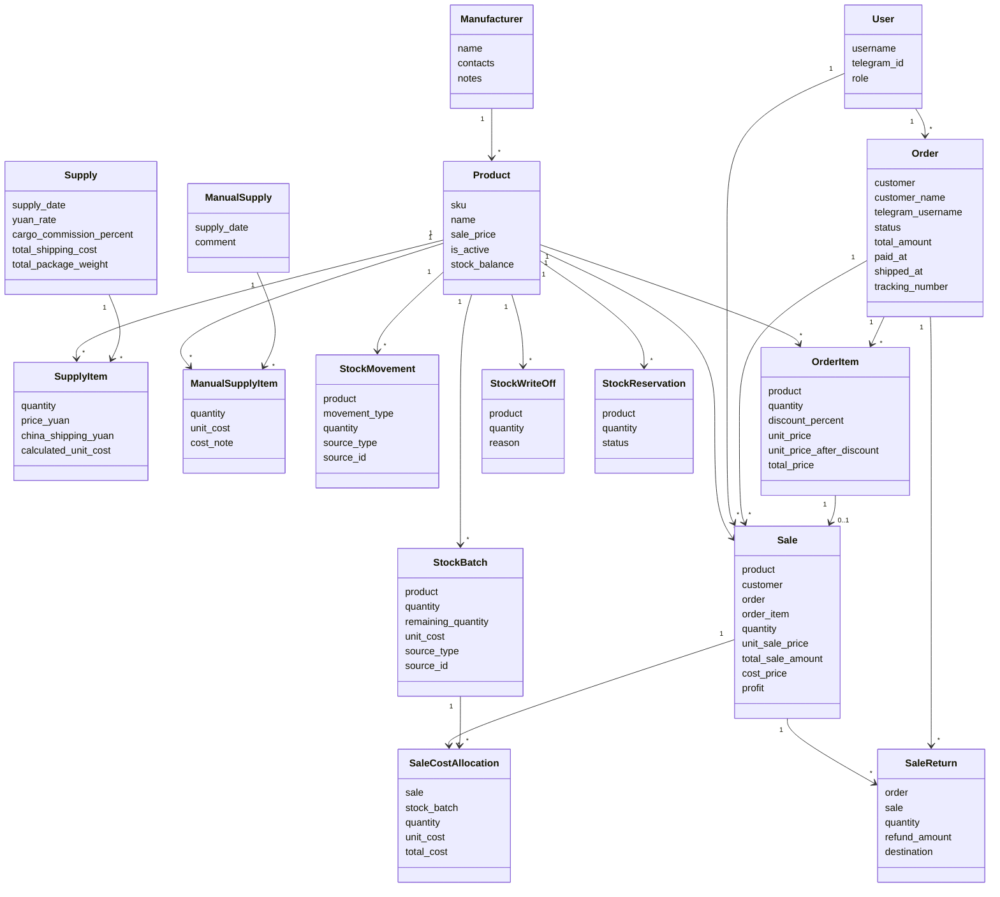
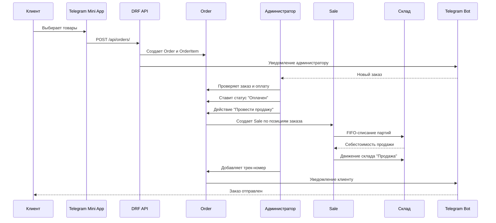
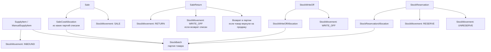
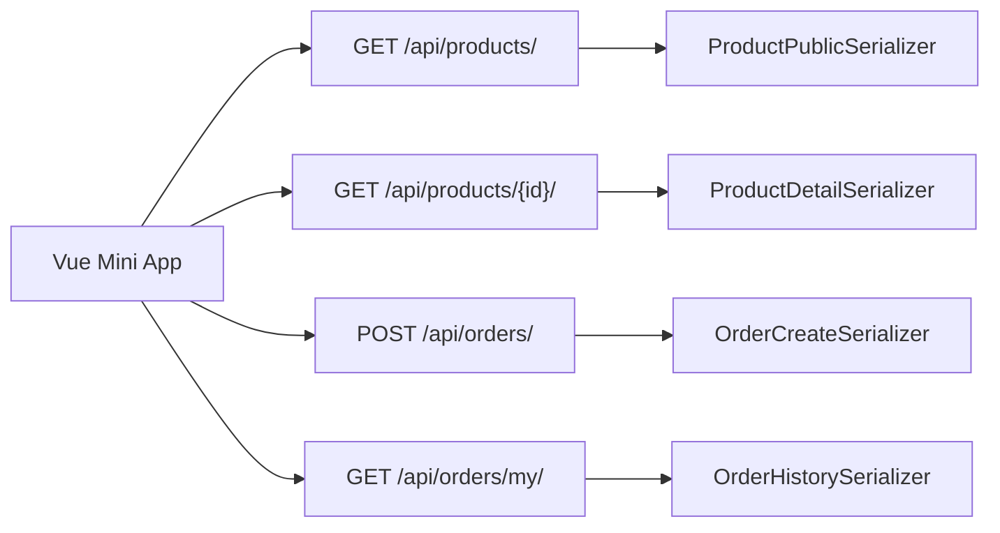
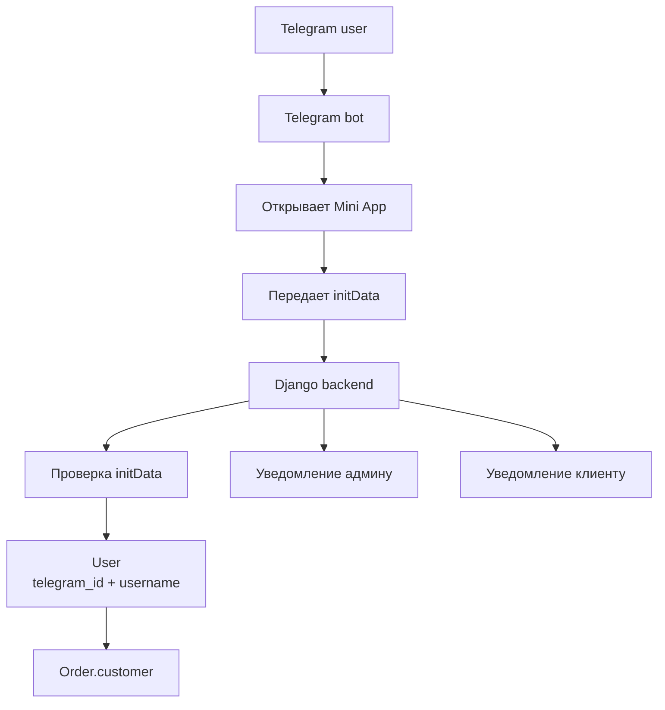
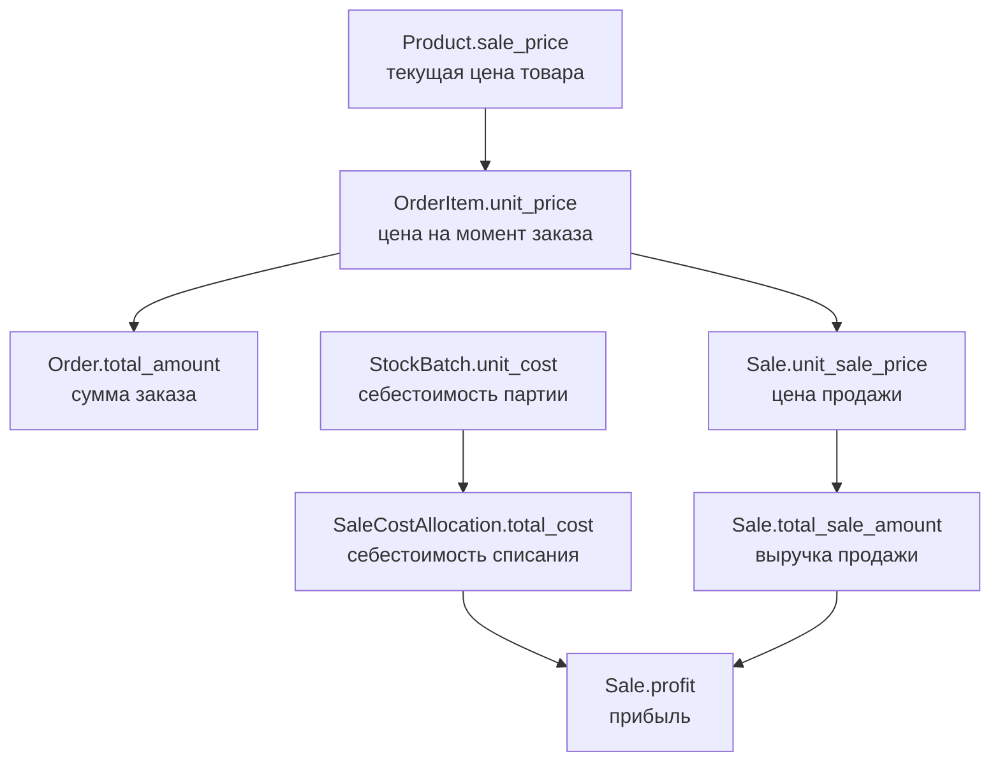

# Архитектура проекта Japanese Sword CRM / ERP

Документ описывает, как устроен проект на уровне модулей, моделей, бизнес-процессов и потоков данных.

Главная мысль архитектуры: система разделяет **заявку клиента**, **факт продажи**, **складские движения**, **партии товара** и **отчеты**. Благодаря этому заказ можно редактировать до оплаты, продажа фиксируется как исторический факт, а остатки и прибыль считаются из событий, а не из ручных полей.

## Контекст системы



### Что здесь важно

- Клиент работает не с Django Admin, а с Telegram Mini App.
- Mini App ходит в backend через REST API.
- Администратор работает через Django Admin.
- Telegram Bot API используется для уведомлений и запуска Mini App.
- Все критичные бизнес-операции проходят через Django backend.

## Django-приложения



## Основные модели и связи



## Почему Order и Sale разделены

`Order` - это заказ или заявка клиента.

Он появляется, когда клиент оформил корзину в Mini App или когда администратор вручную создал заказ в админке.

`Order` сам не списывает склад. До оплаты заказ может меняться: клиент может добавить товар, убрать позицию, попросить скидку или изменить состав заказа.

`Sale` - это факт оплаченной продажи.

Он появляется после подтверждения оплаты и действия "Провести продажу". Именно `Sale`:

- списывает товар со склада;
- запускает FIFO;
- создает движение склада;
- фиксирует себестоимость;
- фиксирует прибыль;
- становится основанием для возврата.

Разделение нужно, чтобы не путать "клиент хочет купить" и "товар реально продан".

## Поток заказа



## Складская архитектура



### Почему остаток считается через StockMovement

Остаток товара - это не самостоятельное поле в `Product`.

Остаток считается как результат истории:

```text
приход + возврат + снятие резерва - продажа - списание - резерв
```

Такой подход делает склад проверяемым. Если остаток изменился, можно открыть журнал движений и увидеть, какая операция на него повлияла.

## FIFO

FIFO используется, чтобы себестоимость продажи считалась по старым партиям в первую очередь.

Пример:

```text
Партия 1: 5 шт. по 1000 руб.
Партия 2: 5 шт. по 1300 руб.

Продажа: 6 шт.

FIFO:
- 5 шт. списываются из партии 1;
- 1 шт. списывается из партии 2.
```

В проекте это фиксируется через `SaleCostAllocation`.

`SaleCostAllocation` хранит:

- какая продажа списала товар;
- из какой партии;
- сколько штук;
- по какой себестоимости;
- какая общая себестоимость списания.

Это нужно для корректной прибыли и возвратов.

## Возвраты

Возврат оформляется по продаже.

`SaleReturn` знает:

- к какому заказу относится возврат;
- по какой продаже оформляется возврат;
- сколько товара возвращается;
- какая сумма возвращается клиенту;
- куда определить товар: вернуть на продажу или списать.

Если товар возвращается на продажу, система возвращает количество в те партии, из которых товар был продан.

Если товар списывается, система создает дополнительное складское движение `WRITE_OFF`.

Защита: нельзя вернуть больше, чем было продано и еще не возвращено.

## Резервы и списания

`StockWriteOff` используется, когда товар окончательно выбыл: брак, повреждение, потеря, недостача.

`StockReservation` используется, когда товар временно нельзя продавать, но он не уничтожен и не списан.

Разница:

```text
Списание - товар окончательно ушел со склада.
Резерв - товар временно убран из доступного остатка.
```

Резерв можно снять. Списание нельзя удалить или откатить напрямую.

## API-архитектура



Публичный API отдает только то, что нужно клиенту.

Он не должен отдавать:

- себестоимость;
- прибыль;
- контакты производителей;
- внутренние комментарии;
- партии товара;
- служебные складские движения.

## Telegram-контур



Telegram ID нужен не для красоты. Он связывает реального Telegram-пользователя с заказами в базе.

Это позволяет:

- показывать клиенту его историю заказов;
- отправлять уведомления конкретному пользователю;
- не просить клиента вручную вводить Telegram ID;
- защищаться от подмены данных через initData.

## Админка

Django Admin в проекте - это не просто техническая панель.

Это рабочее место администратора:

- каталог товаров;
- поставки;
- ручные поставки;
- партии;
- движения склада;
- заказы;
- продажи;
- возвраты;
- резервы;
- списания;
- отчеты.

Некоторые разделы админки являются журналами и защищены от ручного вмешательства.

Например, продажа создается через заказ, а не вручную. Складское движение создается операциями, а не редактируется руками.

## Отчеты

Отчеты читают данные из заказов, продаж, возвратов, товаров и склада.

Они не создают бизнес-событий, а только показывают состояние системы:

- сколько продано;
- сколько возвращено;
- какая чистая выручка;
- какая прибыль;
- какие товары продаются лучше;
- какие товары заканчиваются;
- сколько товара лежит на складе в розничных ценах.

## Где проходят деньги



Цена товара в каталоге может измениться.

Поэтому заказ и продажа фиксируют исторические цены, чтобы старые продажи не пересчитывались задним числом.

## Точки расширения

### PostgreSQL

Сейчас используется SQLite. Следующий взрослый шаг - PostgreSQL.

Это не меняет бизнес-логику, потому что Django ORM изолирует большую часть работы с БД, но делает проект ближе к production.

### Docker

Docker Compose нужен, чтобы запускать проект одинаково на разных машинах:

- backend;
- PostgreSQL;
- frontend;
- telegram bot.

### Тесты

Первые тесты стоит писать не на все подряд, а на самую дорогую бизнес-логику:

- FIFO-списание;
- запрет продажи сверх остатка;
- запрет возврата сверх продажи;
- проведение продажи только из оплаченного заказа;
- публичный API не отдает внутренние поля.

### Celery и Redis

Сейчас они не обязательны.

Они станут полезны, если:

- Telegram-уведомления нужно отправлять в фоне;
- появится тяжелый импорт Excel;
- появятся регулярные задачи;
- HTTP-запросы нельзя будет задерживать внешними API.

### Логирование

Минимальное логирование стоит добавить для:

- создания заказа;
- проведения продажи;
- ошибок Telegram-уведомлений;
- критичных складских операций.

## Как объяснять проект на презентации

Короткий вариант:

> Это CRM/ERP-система для продаж через Telegram. Клиент оформляет заказ в Telegram Mini App, администратор подтверждает оплату в Django Admin, система проводит продажу, списывает склад по FIFO, считает себестоимость и прибыль, а затем показывает аналитику по продажам и остаткам.

Сильные технические места:

- разделение `Order` и `Sale`;
- склад через журнал движений;
- FIFO через партии и allocation-модели;
- защита от ручного нарушения бизнес-логики;
- Telegram Mini App + проверка initData;
- отчеты в админке;
- исторические цены и себестоимость.

